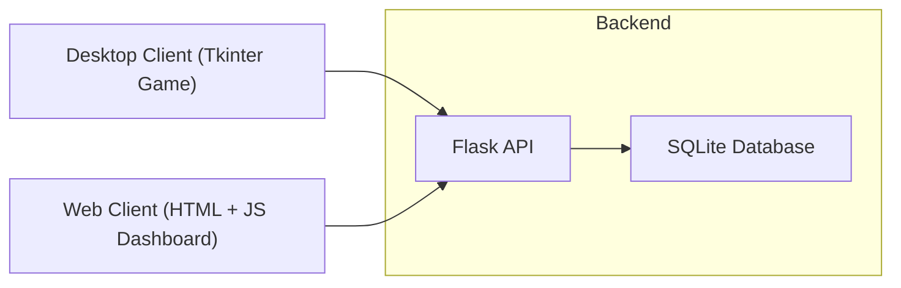
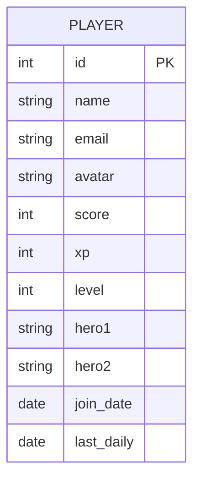
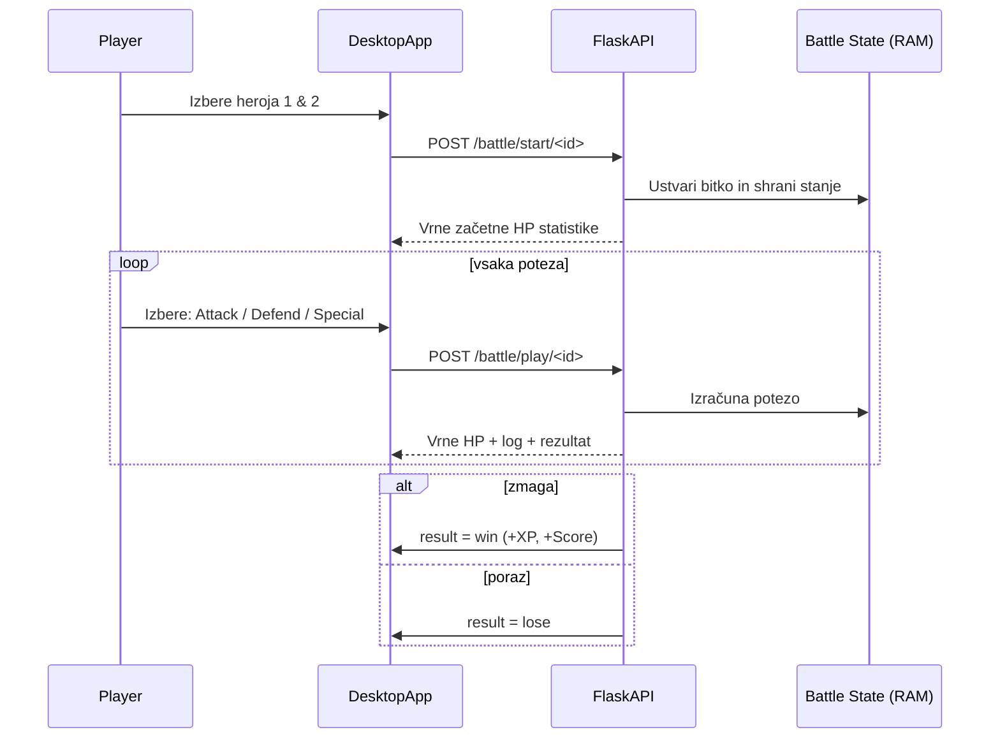

## Slika 1: Arhitektura projekta ScoreHub


ScoreHub je sestavljen iz treh glavnih komponent, ki delujejo preko skupnega Flask REST API-ja.
```text
ScoreHub/
 ├── backend/         ← Flask API + poslovna logika + podatkovna baza
 ├── desktop_client/  ← Tkinter namizni odjemalec (dejanska igra)
 └── web_client/      ← Spletni dashboard (pregled podatkov)
```
## 1. Backend (Flask)

Backend je jedro projekta in vsebuje:

- REST API za upravljanje igralcev

- XP / Level / Score sistem

- Hero sistem (5 herojev s statistikami)

- Bitke (turn-based card combat)

- Dnevne nagrade

- SQLite baza podatkov

# Ključne značilnosti:

API je centralni vir podatkov za desktop + web odjemalca.

Vse operacije na igralcih gredo preko API-ja.

Stanja bitk so shranjena začasno v RAM-u (BATTLES{}).

## 2. Desktop Client (Tkinter)

Namizna aplikacija, kjer se dejansko igra.

# Funkcije:

Pregled in upravljanje igralcev

Izbira dveh herojev

Kartna bitka (napad / obramba / special)

Živi dnevnik boja

Modern UI (neonski gumbi, temna tema)

# Namen:

Igralec igra igro na računalniku, podatki pa se sinhronizirajo v backend.

## 3. Web Client (HTML + JS)

Spletna aplikacija služi kot dashboard:

- Pregled igralcev

- Dodajanje igralcev

- Lestvica najboljših

- Graf prikaza rezultatov

Ni igre — prikazuje podatke iz backend API-ja.

Namen:

Administracija in pregled statistike.

Podatkovni model (Tabela players)
```pgsql
players
players
 ├── id          INTEGER (PK)
 ├── name        TEXT
 ├── email       TEXT
 ├── avatar      TEXT
 ├── score       INTEGER
 ├── xp          INTEGER
 ├── level       INTEGER
 ├── hero1       TEXT
 ├── hero2       TEXT
 ├── join_date   TEXT   (ISO date)
 └── last_daily  TEXT   (ISO date)
```
## Slika 2: Podatkovni model za tabelo players v SQLite.


Arhitektura bitk

1. Desktop odjemalec izbere heroe.

2. Pošlje zahtevo /battle/start/<id>

3. Backend ustvari stanje bitke:
```bash
BATTLES[player_id] = {
   p_hp, p_atk, p_def, p_spec,
   ai_hp, ai_atk, ai_def, ai_spec,
   log: []
}
```

4. Za vsako potezo frontend pošlje:
POST /battle/play/<id>

5. Backend izvede premike, posodobi stanje in vrne rezultat:

- continue

- win (+ XP + Score)

- lose

Po koncu se stanje bitke izbriše.
## Slika 3: Sekvenčni diagram poteka bitke (Battle Flow).

